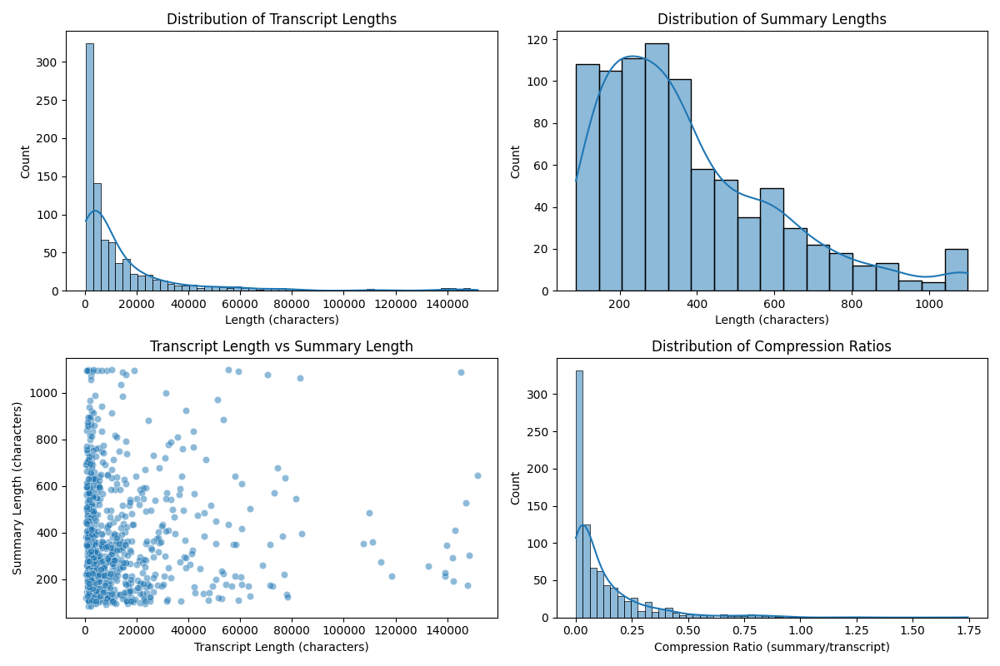
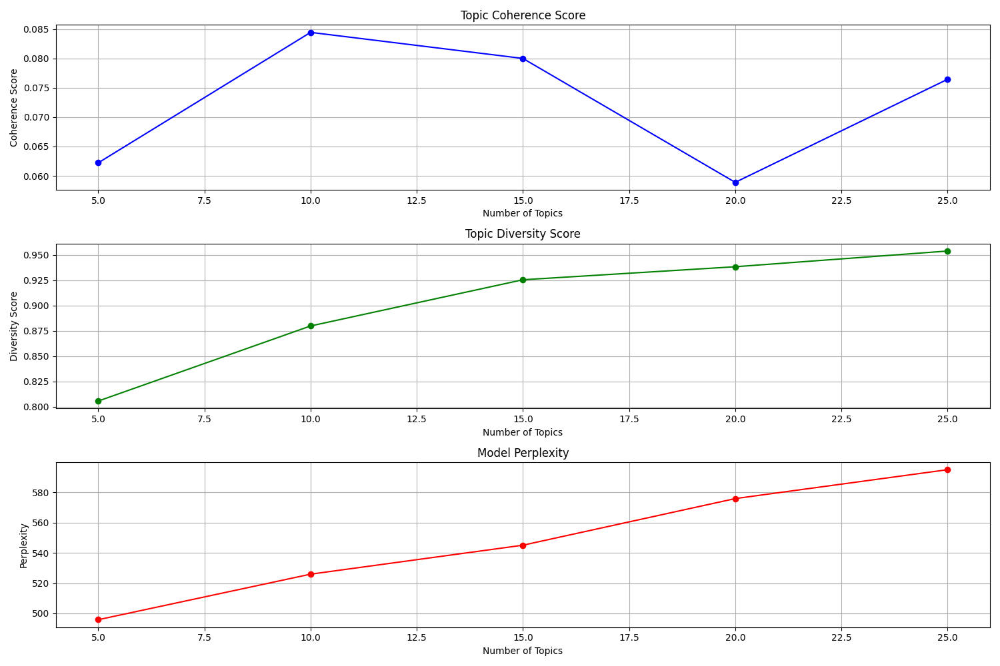

# AI-Powered Meeting Summarizer and Action Tracker

<div align="center">


**Extract valuable insights from meeting transcripts using AI**

[](https://opensource.org/licenses/MIT)
[](https://www.python.org/downloads/)
[](https://reactjs.org/)
[](https://fastapi.tiangolo.com/)

</div>

## 📋 Overview

This application uses AI to analyze meeting transcripts and automatically extract key information:

- **Meeting Summaries**: Concise overviews of the main discussion points
- **Decisions**: Formal agreements and resolutions reached during the meeting
- **Action Items**: Tasks assigned to team members with deadlines

The system uses local LLMs through Ollama for privacy and performance, with a robust rule-based extraction system as fallback.

<div align="center">
  
</div>

## ✨ Features

- **AI-Powered Analysis**: Uses Ollama LLMs (Mistral, Llama, Phi, etc.) for high-quality extraction
- **React Frontend**: Modern, responsive UI with dark mode support
- **FastAPI Backend**: High-performance API for real-time transcript analysis
- **Multi-model Support**: Choose from multiple LLM models based on your needs
- **Caching System**: Reuse analysis results for similar content to improve performance
- **Email Integration**: Share meeting summaries with participants via email
- **Fallback Extraction**: Rule-based extraction when LLM is unavailable or times out
- **Topic Modeling**: Identify key themes and topics across meetings
- **Sentiment Analysis**: Track emotional tone throughout meetings

## 🚀 Getting Started

### Prerequisites

- Python 3.8+ 
- Node.js 14+ and npm
- [Ollama](https://ollama.com/download) for local LLM processing

### Installation

1. **Clone the repository**:
   ```bash
   git clone https://github.com/yourusername/AI-Powered-Meeting-Summarizer-and-Action-Tracker.git
   cd AI-Powered-Meeting-Summarizer-and-Action-Tracker
   ```

2. **Install Python dependencies**:
   ```bash
   pip install -r requirements.txt
   ```

3. **Install and set up Ollama**:
   ```bash
   # For macOS/Linux
   curl -fsSL https://ollama.com/install.sh | sh
   
   # For Windows
   # Download from https://ollama.com/download and follow installation instructions
   
   # Pull required models
   ollama pull mistral  # Default model (4.8GB RAM)
   ollama pull phi      # Alternative smaller model
   ```

4. **Install frontend dependencies**:
   ```bash
   cd frontend
   npm install
   cd ..
   ```

## 💻 Usage

### Starting the Application

1. **Start the backend API**:
   ```bash
   python api.py
   ```
   The API will be available at http://localhost:8000

2. **Start the frontend** (in a new terminal):
   ```bash
   cd frontend
   npm start
   ```
   The application will be available at http://localhost:3000

### Using the Application

1. **Upload a transcript**: Click "Select File" to upload a meeting transcript (.txt or .md)
2. **Select model**: Choose the LLM model to use for analysis
3. **Analyze**: Click "Analyze Transcript" to process the meeting
4. **View results**: See the extracted summary, decisions, and action items
5. **Share**: Email the results to meeting participants if needed

### Command Line Usage

Process meeting transcripts directly from the command line:

```bash
python scripts/extract_meeting_info.py --input data/chunked_transcripts.csv --output results/meeting_extractions.csv --model mistral
```

Run the example script to test the API:

```bash
python example_api_usage.py --model phi
```

## 🔧 Configuration

### API Configuration

The API can be configured through environment variables or a `.env` file:

```
# API settings
PORT=8000
HOST=0.0.0.0
LOG_LEVEL=info

# Email configuration
SMTP_SERVER=smtp.gmail.com
SMTP_PORT=587
SMTP_USERNAME=your-email@gmail.com
SMTP_PASSWORD=your-app-password
EMAIL_FROM=your-email@gmail.com
```

### Model Selection

The application supports various Ollama models:

| Model | RAM Required | Speed | Quality |
|-------|-------------|-------|---------|
| mistral | ~4.8GB | Medium | High |
| llama3.2 | ~8GB | Slow | Very High |
| phi | ~3GB | Fast | Medium |
| gemma | ~4GB | Medium | Medium |

## 🏗️ Technical Architecture

The application consists of several components:

1. **Frontend (React)**:
   - Modern UI built with React and Material-UI
   - File upload and transcript visualization
   - Results display with formatted sections
   - Dark mode support
   - Email sharing functionality

2. **Backend API (FastAPI)**:
   - RESTful API for transcript analysis
   - Model management and caching
   - Email service integration
   - Health monitoring endpoints

3. **AI Processing Pipeline**:
   - Transcript chunking for large documents
   - LLM processing with Ollama
   - Rule-based fallback extraction
   - Response parsing and formatting

4. **Analysis Modules**:
   - Topic modeling with embeddings
   - Sentiment analysis
   - Meeting statistics generation

<div align="center">
  
</div>

## 📊 Analysis Capabilities

### Meeting Summary Extraction

The system identifies the most important points discussed in the meeting, focusing on substantive content rather than procedural remarks.

### Decision Extraction

The system recognizes various types of decisions:
- Formal votes and approvals
- Consensus agreements
- Policy adoptions
- Resource allocations

### Action Item Extraction

The system identifies tasks that need to be completed, including:
- Assigned responsibilities
- Deadlines and timeframes
- Required approvals
- Scheduled follow-ups

## 📝 API Documentation

### Endpoints

#### `POST /analyze`

Analyze a meeting transcript:

```json
{
  "text": "Your meeting transcript text here...",
  "model": "mistral",
  "max_chunk_size": 1500,
  "use_cache": true
}
```

Response:

```json
{
  "success": true,
  "message": "Analysis completed successfully",
  "results": {
    "summary": ["Summary point 1", "Summary point 2"],
    "decisions": ["Decision 1", "Decision 2"],
    "action_items": ["Person A: Task to complete by Friday"]
  },
  "processing_time": 1.25,
  "model_used": "mistral",
  "fallback_used": false
}
```

#### `POST /send-email`

Send meeting analysis results via email:

```json
{
  "to": "recipient@example.com",
  "subject": "Meeting Analysis Results",
  "content": {
    "summary": ["Summary point 1", "Summary point 2"],
    "decisions": ["Decision 1", "Decision 2"],
    "action_items": ["Action item 1", "Action item 2"],
    "metadata": {
      "model": "mistral",
      "processing_time": 1.25,
      "fallback_used": false
    }
  }
}
```

#### `GET /models`

List available Ollama models.

#### `GET /health`

Check API and Ollama health status.

## 🔍 Troubleshooting

### Common Issues

1. **Timeout Errors**: 
   - Increase the timeout value in `scripts/extract_meeting_info.py`
   - Try a smaller model like "phi"
   - Reduce the transcript size

2. **Memory Issues**:
   - Close other applications before running
   - Use a smaller model
   - Process transcripts in smaller chunks

3. **Model Not Found**:
   - Ensure Ollama is running: `ollama list`
   - Pull the required model: `ollama pull mistral`

## 🤝 Contributing

Contributions are welcome! Please feel free to submit a Pull Request.

1. Fork the repository
2. Create your feature branch (`git checkout -b feature/amazing-feature`)
3. Commit your changes (`git commit -m 'Add some amazing feature'`)
4. Push to the branch (`git push origin feature/amazing-feature`)
5. Open a Pull Request

## 📄 License

This project is licensed under the MIT License - see the [LICENSE](LICENSE) file for details.

## 🙏 Acknowledgements

- [Ollama](https://ollama.com/) for local LLM processing
- [FastAPI](https://fastapi.tiangolo.com/) for the API framework
- [React](https://reactjs.org/) for the frontend framework
- [Material-UI](https://mui.com/) for UI components
- [spaCy](https://spacy.io/) for NLP processing